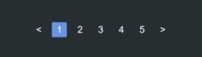

# React Pagination Navbar

[](https://www.npmjs.com/package/react-pagination-nav)
[](https://www.npmjs.com/package/react-pagination-nav)
[](https://www.npmjs.com/package/react-pagination-nav)



## Usage
Install the package
```
npm i react-pagination-nav
```
import the package

```
import ReactPaginationNav from 'react-pagination-nav'
```
```
const MyComponent = () => {
  const [currentPage, setCurrentPage] = React.useState(1)
  
  return (
    <div className="App">
      <ReactPaginationNav
        className="my-pagination-nav-bar-class"
        pageCount={9}
        visiblePages={5}
        currentPage={currentPage}
        goToNextPage={() => setCurrentPage(currentPage + 1)}
        goToPreviousPage={() => setCurrentPage(currentPage - 1)}
        goToPage={(newPage) => setCurrentPage(newPage)}
        PrevNextButton={({ direction, onClick }) => <CustomButton onClick={onClick}>{direction === 'prev' ? '<' : '>'}</CustomButton>}
      />
    </div>
  )
}
```
## props

* `className`       👉 :optional: custom class name for the container
* `pageCount`       👉 total pages
* `visiblePages`    👉 :optional, default 5: number of visible pages, *output would be same for any even number and number + 1*
* `isPreviousBtnHidden` 👉 :optional, if true previous button is hidden
* `isNextBtnHidden` 👉 :optional, if true next button is hidden
* `currentPage`     👉 current active page
* `goToNextPage`    👉 :funtion: called when clicked on right arrow button
* `goToPreviousPage`👉 :funtion: called when clicked on left arrow button
* `goToPage`        👉 :funtion: called when clicked on a page number
* `PrevNextButton`  👉 :optional component: a button component for the prev and next buttons

## Author

[](https://github.com/mohitkyadav)

[](https://discord.gg/bJGQRJx)

# License
MIT Licensed. Copyright (c) Mohit Kumar Yadav 2020.


